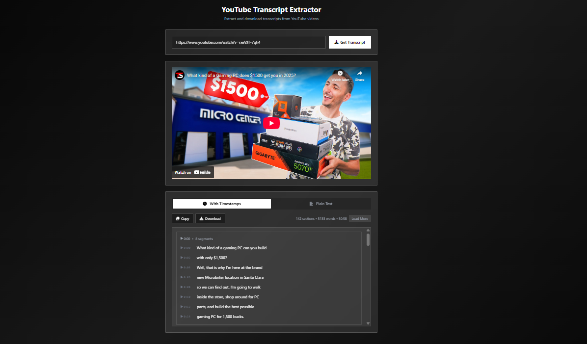

# YouTube Transcript Extractor

A clean, modern web application for extracting and downloading YouTube video transcripts with timestamp support and text editing capabilities.




## ✨ Features

- **Extract Transcripts**: Get transcripts from any YouTube video with available captions
- **Timestamp Support**: View transcripts with clickable timestamps to jump to specific video moments
- **Smart Chunking**: Automatically groups transcript into logical sections for better readability
- **Editable Text**: Click on any transcript text to edit it inline
- **Multiple Formats**: Switch between timestamped and plain text views
- **Download Options**: Save transcripts as .txt files with or without timestamps
- **Copy to Clipboard**: One-click copying of transcript content
- **Mobile Responsive**: Optimized for both desktop and mobile devices
- **Performance Optimized**: Lazy loading for long transcripts to maintain smooth performance

## 🚀 Quick Start

### Prerequisites

- Python 3.7 or higher
- pip (Python package installer)

### Installation

1. **Clone or Download the Repository**

   ```bash
   git clone https://github.com/MohdYahyaMahmodi/youtube-transcript-webapp.git
   cd youtube-transcript-webapp
   ```

2. **Install Required Dependencies**

   ```bash
   pip install flask youtube-transcript-api flask-cors
   ```

3. **Run the Application**

   ```bash
   python app.py
   ```

4. **Open in Browser**
   ```
   http://localhost:5000
   ```

## 📋 System-Specific Setup Instructions

### 🪟 Windows

1. **Install Python**

   - Download Python from [python.org](https://www.python.org/downloads/)
   - During installation, check "Add Python to PATH"
   - Verify installation: `python --version`

2. **Open Command Prompt or PowerShell**

   ```cmd
   # Navigate to project folder
   cd C:\path\to\youtube-transcript-extractor

   # Install dependencies
   pip install flask youtube-transcript-api flask-cors

   # Run application
   python app.py
   ```

### 🐧 Linux (Ubuntu/Debian)

1. **Install Python and pip**

   ```bash
   sudo apt update
   sudo apt install python3 python3-pip
   ```

2. **Set up the application**

   ```bash
   # Navigate to project folder
   cd ~/youtube-transcript-webapp

   # Install dependencies
   pip3 install flask youtube-transcript-api flask-cors

   # Run application
   python3 app.py
   ```

### 🍎 macOS

1. **Install Python using Homebrew (recommended)**

   ```bash
   # Install Homebrew if not already installed
   /bin/bash -c "$(curl -fsSL https://raw.githubusercontent.com/Homebrew/install/HEAD/install.sh)"

   # Install Python
   brew install python
   ```

2. **Set up the application**

   ```bash
   # Navigate to project folder
   cd ~/youtube-transcript-webapp

   # Install dependencies
   pip3 install flask youtube-transcript-api flask-cors

   # Run application
   python3 app.py
   ```

## 📁 Project Structure

```
youtube-transcript-webapp/
├── app.py                 # Flask backend server
├── templates/
│   └── index.html        # Main HTML template
├── static/
│   └── app.js           # Frontend JavaScript
├── README.md            # This file
├── image.png            # Demo screenshot
└── requirements.txt     # Python dependencies (optional)
```

## 📦 Dependencies

The application requires these Python packages:

- **Flask** - Web framework for the backend server
- **youtube-transcript-api** - Library to fetch YouTube transcripts
- **flask-cors** - Cross-Origin Resource Sharing support

Install all at once:

```bash
pip install flask youtube-transcript-api flask-cors
```

Or create a `requirements.txt` file:

```
flask>=2.0.0
youtube-transcript-api>=1.6.0
flask-cors>=4.0.0
```

Then install with:

```bash
pip install -r requirements.txt
```

## 🔧 Configuration

### Port Configuration

By default, the application runs on port 5000. To change this:

```python
# In app.py, modify the last line:
app.run(host='0.0.0.0', port=8080, debug=True)  # Change port to 8080
```

### Production Deployment

For production use, set `debug=False`:

```python
app.run(host='0.0.0.0', port=5000, debug=False)
```

## 🎯 Usage

1. **Start the Application**

   ```bash
   python app.py
   ```

2. **Open Your Browser**

   - Navigate to `http://localhost:5000`

3. **Extract a Transcript**

   - Paste any YouTube video URL in the input field
   - Click "Get Transcript" or press Enter
   - Wait for the transcript to load

4. **Use the Features**
   - **View Options**: Switch between "With Timestamps" and "Plain Text" tabs
   - **Edit Text**: Click on any transcript text to edit it
   - **Jump to Video**: Click timestamp buttons to open the video at that time
   - **Copy Content**: Use the "Copy" button to copy to clipboard
   - **Download**: Use the "Download" button to save as a .txt file

## 🔍 Supported YouTube URLs

The application supports various YouTube URL formats:

- `https://www.youtube.com/watch?v=VIDEO_ID`
- `https://youtu.be/VIDEO_ID`
- `https://youtube.com/embed/VIDEO_ID`
- `https://youtube.com/shorts/VIDEO_ID`
- `www.youtube.com/watch?v=VIDEO_ID` (without https)

## ⚠️ Limitations

- **Captions Required**: Videos must have auto-generated or manual captions available
- **Language Support**: Primarily works with English captions (other languages supported if available)
- **Rate Limiting**: YouTube may rate-limit requests if used excessively
- **Private Videos**: Cannot access transcripts from private or restricted videos

## 🛠️ Troubleshooting

### Common Issues

1. **"No transcript available" Error**

   - Video doesn't have captions enabled
   - Video is private or restricted
   - Video is too new (captions not yet generated)

2. **"Invalid YouTube URL" Error**

   - Check URL format is correct
   - Ensure it's a valid YouTube video link

3. **Server Won't Start**

   - Check if port 5000 is already in use
   - Verify Python and pip are installed correctly
   - Ensure all dependencies are installed

4. **Slow Performance**
   - Long videos may take time to process
   - The app loads transcripts in chunks for better performance

### Getting Help

If you encounter issues:

1. Check the browser console for JavaScript errors
2. Check the terminal/command prompt for Python errors
3. Verify all dependencies are installed: `pip list`
4. Try with a different YouTube video

## 🤝 Contributing

Contributions are welcome! Here's how you can help:

1. **Fork the Repository**
2. **Create a Feature Branch**
   ```bash
   git checkout -b feature/your-feature-name
   ```
3. **Make Your Changes**
4. **Test Thoroughly**
5. **Submit a Pull Request**

### Development Guidelines

- Follow PEP 8 for Python code styling
- Add comments for complex logic
- Test with various YouTube videos
- Ensure mobile responsiveness
- Maintain accessibility features

## 📄 License

This project is licensed under the MIT License - see the [LICENSE](LICENSE) file for details.

## 🙏 Acknowledgments

- [youtube-transcript-api](https://github.com/jdepoix/youtube-transcript-api) - Core transcript extraction functionality
- [Flask](https://flask.palletsprojects.com/) - Web framework
- [Tailwind CSS](https://tailwindcss.com/) - Styling framework
- [Font Awesome](https://fontawesome.com/) - Icons

## 📊 Technical Details

### Architecture

- **Backend**: Flask (Python) - Handles transcript extraction and API endpoints
- **Frontend**: Vanilla JavaScript - Manages UI interactions and display
- **Styling**: Tailwind CSS with custom glassmorphism effects
- **API**: RESTful design with JSON responses

### Performance Features

- Lazy loading for long transcripts
- Debounced text editing
- Efficient DOM manipulation with document fragments
- Responsive design for all screen sizes

### Browser Support

- Chrome 60+
- Firefox 55+
- Safari 12+
- Edge 79+

---

## 👨‍💻 Author

**Mohd Yahya Mahmodi**

- Twitter/X: [@mohdmahmodi](https://twitter.com/mohdmahmodi)
- GitHub: [MohdYahyaMahmodi](https://github.com/MohdYahyaMahmodi)

**Made with ❤️ for the open source community**
